# Sqrzl Architecture

This document maps the current Sqrzl emulator architecture as Mermaid diagrams.
It is source-oriented: the nodes name the modules, contracts, ports, and runtime
paths that exist in this repository.

## System Context

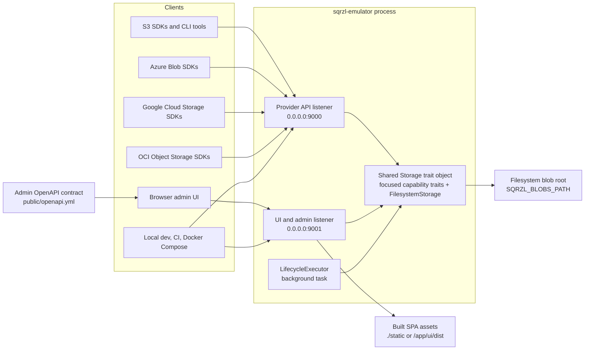

## Runtime Composition

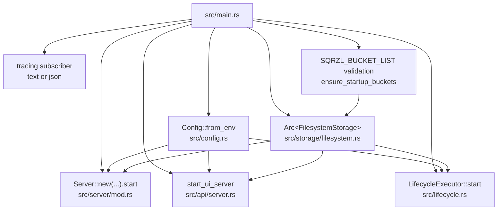

## Provider API Request Path

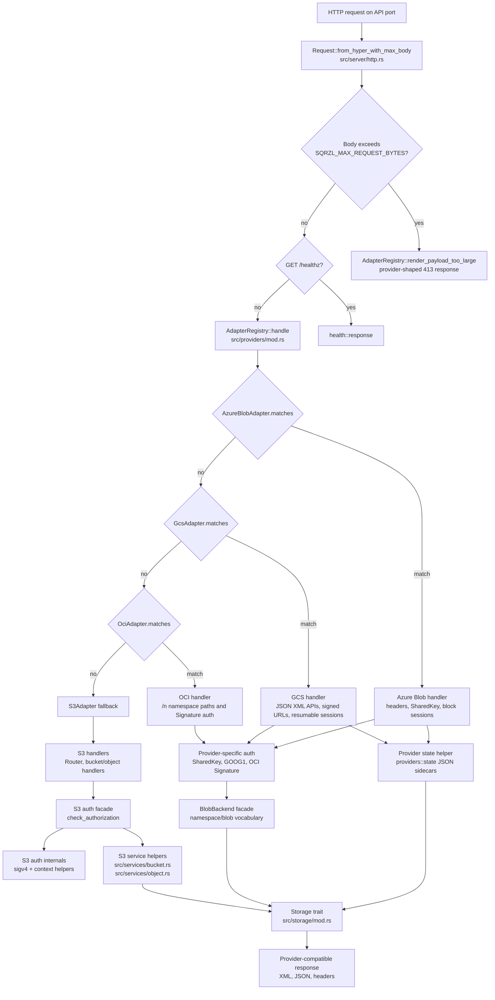

## S3 Handler Breakdown

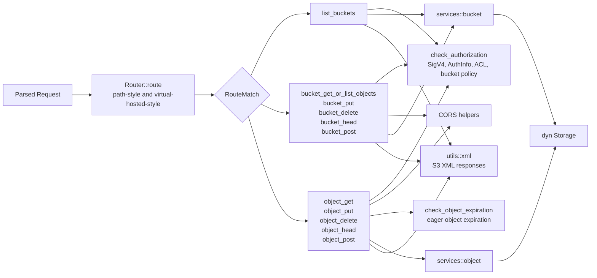

## Admin UI And Admin API

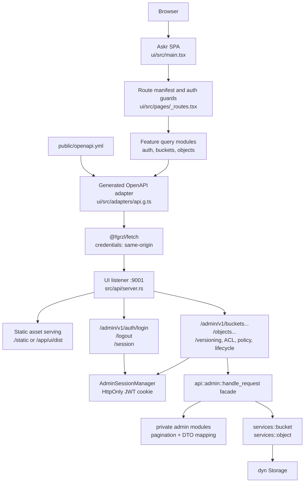

## Admin API Surface

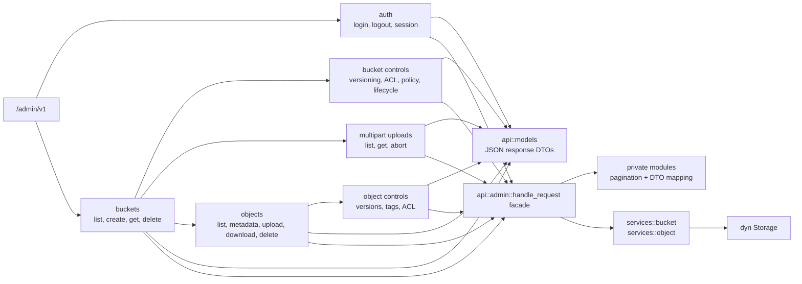

## Storage Backend And Disk Layout

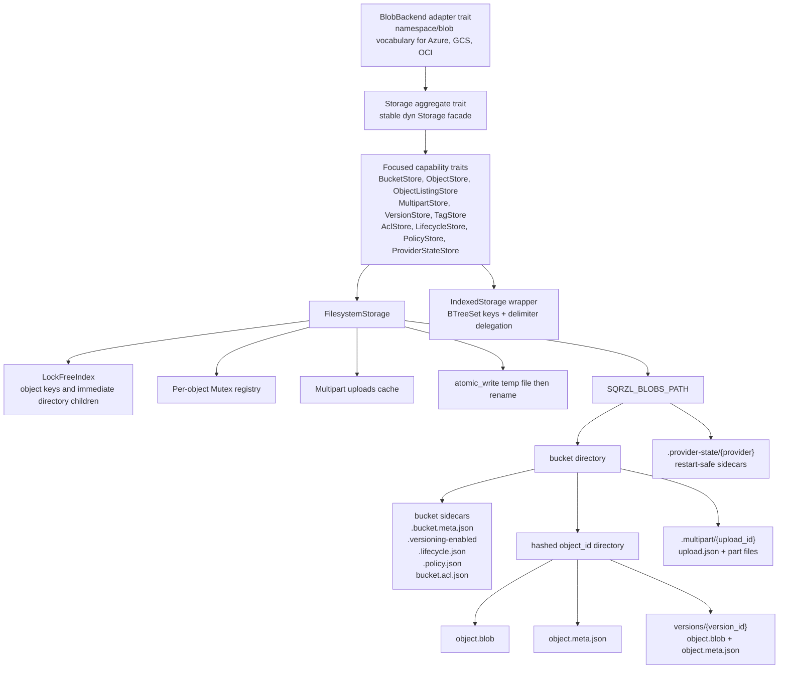

## Auth And Authorization

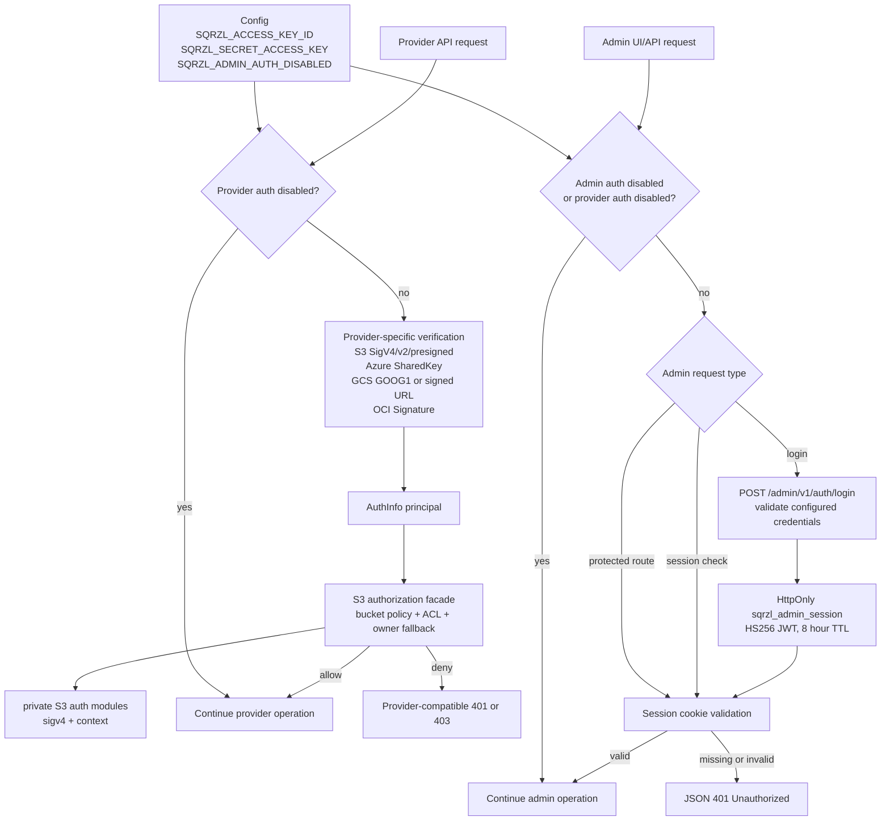

## Lifecycle Enforcement

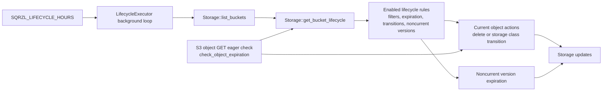

## Deployment Shape

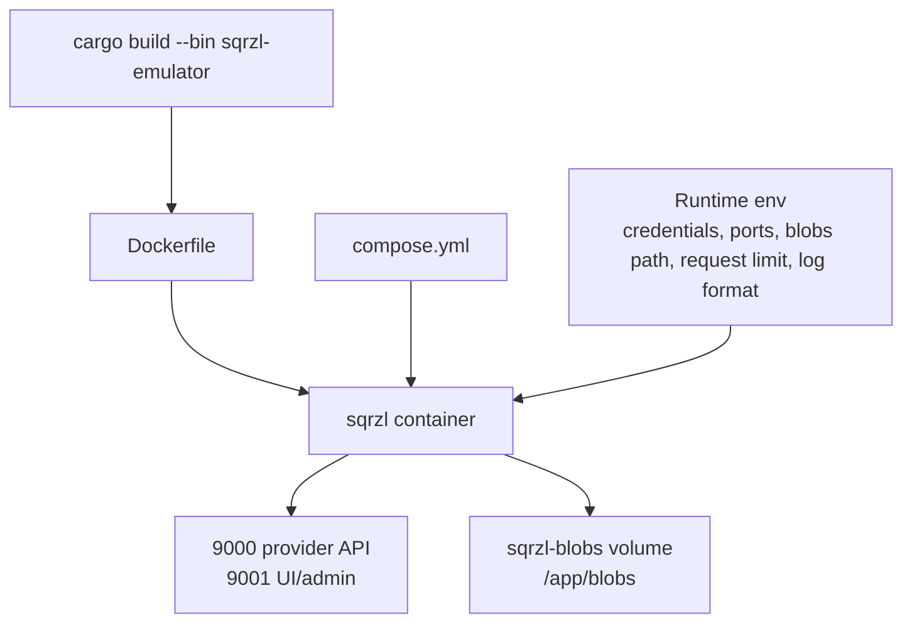

## Verification Architecture

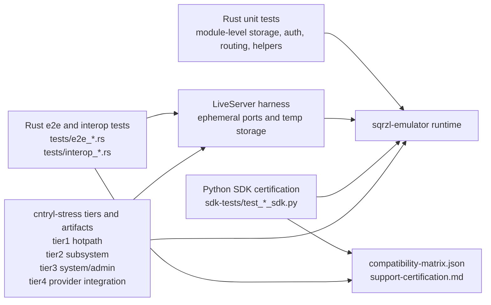
